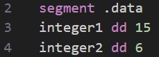
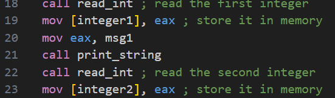
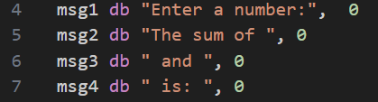
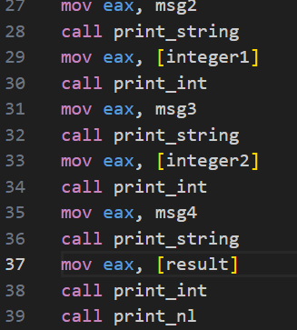
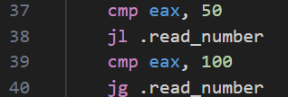
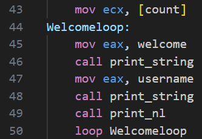
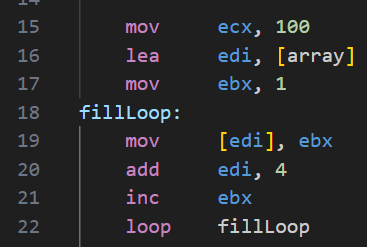
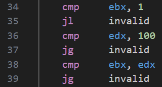
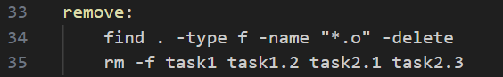

# OS_Worksheet1
## Directory
Starting this worksheet I created the directory structure defined in the worksheet however i made two more folders to separate task 1 and 2:
repo-name
    README.md
    src
        asm_io.inc
        asm_io.asm
        Task1
            XXX
        Task2
            XXX
Makefile

## Task 1 - Basic arithmetic
In task 1 I focused on writing two simple assembly program that can do some basic arithmetic. 
The programs I implemented were:
* The first program adds two predefined integers and prints the results 
* The second program reads two integers from the users input, adds them together and outputs the result.
* And a shared C file used to call the assembly entry point asm_main() for both the programs.

### Provided files
The files the were provided and used across all these tasks include:
* asm_io.asm  and asm_io.inc which provide basic input/output routines such as read_int, print_int and print_string.
* driver.c which contains main() which calls asm_main()

### Task 1.1 - Adding two internal variables
In this task I defined two integers in the .data segment and then added them together using registers. The result is stored in memory and printed using print_int.

The steps I took to complete this task involve:
* Loading both integers into EAX,
* Then performing the addition,
* storing the result,
* printing the end result.

Storing snippet: 

Addition and printing snippet:

### Task 1.2 - Adding users input
This task extends upon task 1.1 by requesting an input from the user to perform the addition.

My program:
* prompts the user for two numbers using print_string,
* reads each number using read_int,
* Stores the inputs in memory,
* performs the addition,
* And finally outputs the result.

Input handling snippet:

Formatting is achieved alternating between these strings and print calls:

### Building and Running
Both programs were compiled and linked using a Makefile with NASM and GCC in 32-bit mode with two executable programs:
* task1
* task1.2

## Task 2 - Loops, conditionals, and Working with data 
In task 2 I had to focus on implementing loops, conditionals and user interactions in assembly. 

The two programs i developed for this task include:
* task2.1.asm which takes a name and prints a welcome message for the requested amount of time.
* task2.3.asm this program initialises an array and takes a user defined range then computes the sum of that range.

### Task 2.1 - Loops and input validation
This program asks the user for their name and how many times they want a welcome message printed. The program validates that the input is between 50 and 100 before entering the print loop.

The users name is read one character at a time using read_char until a newline is encountered and each character is stored in a buffer.

Example snippet:

the number of repetitions is validated using comparisons and conditional jumps shown here:

If the input is out of range the program will ask again until a valid number is provided.

The welcome message is printed using a counted loop with ECX and the loop instruction:

## Task 2.3 - Sum of user defined range
This program originally added the sum of all the numbers between 1 - 100 however it was modified to allow the user to input the start and end of the range. 

An array is filled using a loop that writes values into memory: 

The users input is checked to ensure the start is more than 0 and less than or equal to 100 while ensuring that the start is smaller than the end.

If the validation fails, an error message is displayed and the program exits.

## Task 3 - Makefile
In task 3 all I had to do was automate the building process of all the programs throughout this worksheet. 
The makefile structure contains commands for each program which contain:
* The object file target built with NASM
* a final linking step using GCC
* a shared dependencies on asm_io.o and driver.o

I defined an all target to build every program in one command:

Finally, I added a remove rule to remove generated object files and executables allowing the project to be rebuilt from a clean state.

